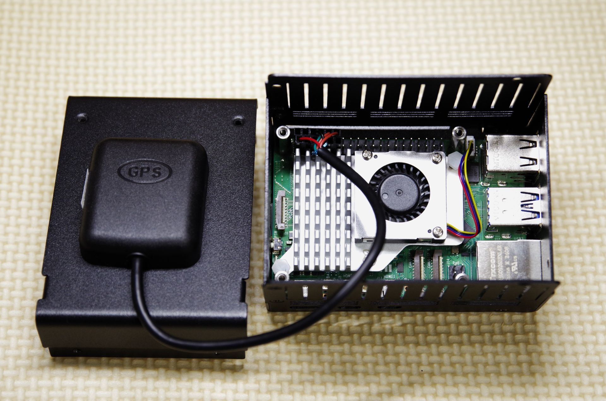

# OrionFieldStack

# 1. プロジェクト概要📝
OrionFieldStack は、Raspberry Pi 5を使用した、フィールドにおける天体撮影を支援する統合ツールキットです。自動撮影・データ取得のみならず、画像解析（プレートゾルビング）で、撮影した天体の位置を自動で割り出せます。

* リモート観測の自動化: VNC（Virtual Network Computing）を介した遠隔操作に対応。現場に張り付くことなく、安定した自動撮影ルーチンを実行可能です。

* 多角的なデータロギング: 撮影画像だけでなく、GPSによる正確な位置情報や時刻情報、INDI機器から取得したの環境情報を紐付けて記録します。観測時のコンディションと画像ファイルをセットで管理します。

* 画像解析（Plate Solving）: 撮影した画像から天体の座標を自動で特定・認識（プレートゾルビング）し、メタデータとして記録します。

# 2. 構成モジュール📋
リポジトリ内は以下の4つの主要コンポーネントで構成されています
| モジュール | 役割 | 概要 |
|:---|:---|:---|
| **gpssetup** | GPSセットアップ | GPSユニットから取得した、正確な位置、時間をシステムに反映させます。|
| **ShutterPro03** | カメラ制御 | リレー回路によるシャッター制御とFlashAirを使ったデータ通信、INDI連携を統合し、USB制御に対応しないカメラでも高度な自動撮影を実現するツールです。OrionFieldStackプロジェクトの一環として、標準化された撮影ログを出力します。|
| **SkySolverEngine(SSE)** | 画像解析 | 撮影された画像ファイルをプレートゾルビングにより、正確な位置を取得し、標準化された撮影ログに追記します。|
| **SkySync** | 天体導入支援 | ShutterPro03、SSE、INDI通信を使い、赤道儀の向きを正確に同期させます。 |


# 3. 基本フォルダ構成🗃️
```text
~ (Home Directory)
├── OrionFieldStack/   # ===【プログラム層】==================================
│   ├── README.md               # プロジェクト全体の概要（本ファイル）
│   │     
│   ├── gpssetup/               # GPSモジュールのセットアップツール -----------
│   │   ├── README.md
│   │   └── gpssetup.sh
│   │
│   ├── shutterpro03/           # カメラ制御プログラム -----------------------
│   │   ├── README.md
│   │   ├── requirement.txt     # 必要な依存ライブラリのリスト
│   │   ├── config.json         # 全体設定（接続先・パス・デフォルト値）
│   │   ├── shutterpro03.py     # メイン制御（エントリーポイント）
│   │   ├── sp03_utils.py       # 共通ユーティリティ（時間計算、パス変換等）
│   │   ├── sp03_logger.py      # ログ生成エンジン
│   │   ├── sp03_manual.md      # 詳細取扱説明書
│   │   └── OFS_json_spec.md    # ログファイルの仕様書
│   │
│   ├── SSE/                    # 画像解析プログラム（プレートゾルビング）-----
│   │   ├── README.md
│   │   ├── requirement.txt     # 必要な依存ライブラリのリスト
│   │   ├── SSE.py              # メイン制御（エントリーポイント）
│   │   └── SSE_Technical_Spec.md
│   │
│   └── skysync/                # 天体導入支援プログラム（自動同期）----------
│       ├── README.md
│       ├── requirement.txt     # 必要な依存ライブラリのリスト
│       └── skysync.py          # メイン制御（エントリーポイント）
│   
└── Pictures/         # === 【データ層】任意に設定可能=======================
    ├── IMG_XXXX.dng        # 撮影された生画像
    ├── latest_shot.json    # ツール間連携用リアルタイムバッファ
    ├── shutter_log.json    # 累積詳細ログ (JSON)
    └── shutter_log.csv     # 閲覧用累積ログ (CSV)
```


# 4. ハードウェア構成⚙️
GPSは、シリアル通信を行います。
カメラのシャッターを制御は、RPiから直接信号を送るのではなく、フォトカプラやリレーモジュールを介してカメラのレリーズ端子を短絡させます。

## 4.1 配線図

```text
Raspberry Pi 5 (GPIO Header)               External Components
    ___________________                ____________________________
   |                   |              |      [ GPS Module ]        |
   | (Pin 1) [3.3V] ●--|--------------|--● [VCC]                   |
   | (Pin 6) [GND]  ●--|--------------|--● [GND]                   |
   | (Pin 8) [TXD]  ●--|--------------|--● [RX] (Cross)            |
   | (Pin 10)[RXD]  ●--|--------------|--● [TX] (Cross)            |
   |                   |              |____________________________|
   |                   |               ____________________________
   |                   |              |   [ PC817 Photocoupler ]   |
   |                   |              |                            |
   | (Pin 12)[GP18] ●--|----[220Ω]----|--● (Pin 1)[A]    (Pin 4)●--|---> [Camera Shutter]
   |                   |              |                            |
   | (Pin 14)[GND]  ●--|--------------|--● (Pin 2)[C]    (Pin 3)●--|---> [Camera Common]
   |___________________|              |____________________________|
    
    ● = Connected pins / (Pin #) = Physical Pin Number
```
| ピン番号 (Physical) | 名前 | 役割 |
|:---|:---|:---|
| **2 (5V) / 6 (GND)** | Power | `GPSモジュールやリレーボードへの電源供給` |
| **8 (GPIO 14 / TX)** | UART TX | `gps-setup: GPSモジュールへの設定送信` |
| **10 (GPIO 15 / RX)** | UART RX | `gps-setup: GPSデータの受信` |
| **11 (GPIO 17)** | GPIO Out | `shutterpro03: カメラシャッター切替え（リレー/フォトカプラ経由）` |

## 4.2 外観💻


## ⚖️ License
© 2026 OrionFieldStack Project / MIT License

Official Web: [voyager3.stars](https://voyager3.stars.ne.jp)
