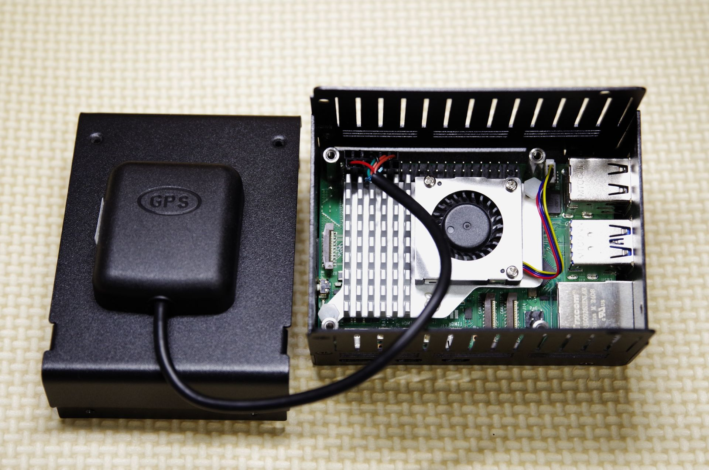

# OrionFieldStack v1.4.5

# 1. プロジェクト概要📝
OrionFieldStack は、Raspberry Pi 5を使用した、フィールドにおける天体撮影を支援する統合ツールキットです。自動撮影・データ取得のみならず、画像解析（プレートゾルビング）で、撮影した天体の位置を自動で割り出し、撮影データのスタッキングが可能です。

* リモート観測の自動化: VNCなどを利用して離れた場所から操作・監視が可能です。

## インストール手順 (Installation)

1. **リポジトリのクローン**
   以下のコマンドでリポジトリをクローンします。
   ```bash
   git clone https://github.com/voyager3stars/OrionFieldStack.git
   cd OrionFieldStack
   ```

### 【推奨】自動セットアップスクリプトを使用する場合

リポジトリ内のセットアップスクリプトを実行することで、システム要件のインストールから仮想環境の構築、必要なPythonパッケージのインストールまでを自動で行います。

```bash
chmod +x ofs_setup_env.sh
./ofs_setup_env.sh
```

---

### 手動でセットアップする場合

スクリプトを使用せず、手動で環境を構築する場合は以下の手順に従ってください。

2. **システム依存ライブラリのインストール**
   一部のパッケージ（`dbus-python`など）のビルドに必要なシステムライブラリをインストールします。
   ```bash
   sudo apt-get update
   sudo apt-get install -y libdbus-1-dev libglib2.0-dev
   ```

3. **仮想環境の作成と依存パッケージのインストール**
   Pythonの仮想環境（venv）を作成し、パッケージをインストールします。
   ```bash
   python3 -m venv venv
   source venv/bin/activate
   pip install -r requirements.txt
   ```

# 2. 構成モジュール📋
リポジトリ内は以下の主要コンポーネントで構成されています
| モジュール | 役割 | 概要 |
|:---|:---|:---|
| **ShutterPro03** | カメラ制御 | リレー回路によるシャッター制御とFlashAirを使ったデータ通信、INDI連携を統合し、USB制御に対応しないカメラでも高度な自動撮影を実現するツールです。OrionFieldStackプロジェクトの一環として、標準化された撮影ログを出力します。|
| **SkySolverEngine(SSE)** | 画像解析 | 撮影された画像ファイルをプレートゾルビングにより、正確な位置を取得し、標準化された撮影ログに追記します。|
| **SkySync** | 天体導入支援 | ShutterPro03、SSE、INDI通信を使い、赤道儀の向きを正確に同期させます。 |
| **StarFlux** | 画像解析 | 撮影された天体画像から星を検出し、その形状（FWHM：半値幅、楕円率）を統計的に解析し、画像のクオリティを定量化するツールです |
| **StarForge** | 画像処理 | `StarFlux` による画像品質解析の結果を活用し、複数の天体画像を自動的に位置合わせ・スタッキングするツールです。高品質なマスター FITS ファイルの生成を目的としています。 |
| **LogHarmonizer** | ログ管理 | 天体撮影ログのマスターデータである shutter_log.json と、編集・閲覧用の shutter_log.csv の間でデータの整合性を保ち、双方向に同期するためのツールです。OrionFieldStack JSON Specに完全準拠しており、ShutterPro03、SkySolverEngine (SSE)、StarFlux によって生成されたデータの管理を容易にします。 |
| **ExifScribe** | ログ管理 | ExifScribeは、撮影されたDNGファイルからEXIF情報を抽出し、`shutter_log.json` の該当レコードを補完または更新するためのツールです。OrionFieldStackのJSON Specに準拠し、記録漏れや情報の不一致を効率的に解消します。 |
| **ofs_link** | テレメトリリンク | INDIサーバーおよびGPSDから、望遠鏡架台（マウント）のステータス、赤経・赤緯、ピアーサイド、GPS位置情報、および高精度なタイムスタンプ情報を取得し、標準化されたJSON形式で出力するCUIツールです。|
| **ofs_gui** | 統合Web GUI | `shutterpro03` の撮影制御や `SSE` の画像解析などをブラウザから一元管理・操作するための、FastAPIベースの統合Webコントロールパネルです。|
| **imgfileharmonizer**| 画像・ログ整合 | 撮影ログ（JSON/CSV）とディスク上の画像ファイルの実体を突き合わせ、整合性の監査および不要ファイルの整理（ゴミ箱退避）を行うツールです。|
| **logmigrator** | ログ移行 | `shutter_log.json` の構造を、古いフォーマットから最新の v1.6.0 仕様へ安全に変換（マイグレーション）する移行用ツールです。|


# 3. 基本フォルダ構成🗃️
```text
~ (Home Directory)
├── OrionFieldStack/   # ===【プログラム層】==================================
│   ├── README.md               # プロジェクト全体の概要（本ファイル）
│   ├── requirements.txt        # 全モジュール共通の依存ライブラリリスト
│   ├── ofs_setup_env.sh        # 環境構築スクリプト
│   │     

│   ├── shutterpro03/           # カメラ制御プログラム -----------------------
│   │   ├── README.md
│   │   ├── config.json         # 全体設定（接続先・パス・デフォルト値）
│   │   ├── shutterpro03.py     # メイン制御（エントリーポイント）
│   │   ├── sp03_utils.py       # 共通ユーティリティ（時間計算、パス変換等）
│   │   ├── sp03_logger.py      # ログ生成エンジン
│   │   ├── sp03_manual.md      # 詳細取扱説明書
│   │   └── OFS_json_spec.md    # ログファイルの仕様書
│   │
│   ├── SSE/                    # 画像解析プログラム（プレートゾルビング）-----
│   │   ├── README.md
│   │   ├── SSE.py              # メイン制御（エントリーポイント）
│   │   └── SSE_Technical_Spec.md
│   │
│   ├── skysync/                # 天体導入支援プログラム（自動同期）----------
│   │   ├── README.md
│   │   └── skysync.py          # メイン制御（エントリーポイント）
│   │　　  
│   ├── starflux/               # 画像のクオリティを定量化するツール ----------
│   │   ├── README.md
│   │   └── starflux.py         # メイン制御（エントリーポイント）
│   │　　  
│   ├── starforge/              # 複数の天体画像のスタッキングツール ----------
│   │   ├── README.md
│   │   ├── starforge.py        # メイン制御（エントリーポイント）
│   │   ├── sf_align.py
│   │   ├── sf_loader.py
│   │   └── sf_stack.py
│   │
│   ├── logharmonizer/          # ログファイルの整合・同期ツール -------------
│   │   ├── README.md
│   │   ├── logharmonizer1_6.py  # メイン制御（エントリーポイント）
│   │   └── config.json       　# デフォルトの保存場所の設定
│   │
│   ├── exifscribe/             # EXIF情報を抽出 ---------------------------
│   │   ├── README.md
│   │   └── exifscribe.py        # メイン制御（エントリーポイント）
│   │
│   ├── ofs_link/               # テレメトリリンクツール --------------------
│   │   ├── README.md
│   │   ├── ofs_link.py          # メイン制御（エントリーポイント）
│   │   └── config.json          # 接続・フォールバック設定
│   │
│   ├── ofs_gui/                # 統合Web GUIコントロールパネル -------------
│   │   ├── README.md
│   │   ├── app.py               # WebバックエンドAPI（エントリーポイント）
│   │   └── static/              # フロントエンドソース（HTML/CSS/JS）
│   │
│   ├── imgfileharmonizer/      # 画像ファイルとログの整合監査ツール ---------
│   │   ├── README.md
│   │   └── imgfileharmonizer1_6.py # メイン制御（エントリーポイント）
│   │
│   └── logmigrator/            # ログデータ構造移行ツール ------------------
│       ├── README_1_6.md
│       └── logmigrator_1_6.py   # メイン制御（エントリーポイント）
│   
└── Pictures/         # === 【データ層】任意に設定可能=======================
    ├── IMG_XXXX.dng        # 撮影された生画像
    ├── latest_shot.json    # ツール間連携用リアルタイムバッファ
    ├── shutter_log.json    # 累積詳細ログ (JSON)
    └── shutter_log.csv     # 閲覧用累積ログ (CSV)
```


# 4. ハードウェア構成⚙️
カメラのシャッター制御は、RPiから直接信号を送るのではなく、フォトカプラを介してカメラのレリーズ端子を短絡させます。

## 4.1 配線図

```text
Raspberry Pi 5 (GPIO Header)               External Components
    ___________________                ____________________________
   |                   |              |      [ GPS Module ]        |
   | (Pin 1) [3.3V] ●--|--------------|--● [VCC]                   |
   | (Pin 6) [GND]  ●--|--------------|--● [GND]                   |
   | (Pin 8) [TXD]  ●--|--------------|--● [RX] (Cross)            |
   | (Pin 10)[RXD]  ●--|--------------|--● [TX] (Cross)            |
   |                   |              |____________________________|
   |                   |               ____________________________
   |                   |              |   [ PC817 Photocoupler ]   |
   |                   |              |                            |
   | (Pin 13)[GP27] ●--|----[220Ω]----|--● (Pin 1)[A]    (Pin 4)●--|---> [Camera Shutter]
   |                   |              |                            |
   | (Pin 14)[GND]  ●--|--------------|--● (Pin 2)[C]    (Pin 3)●--|---> [Camera Common]
   |___________________|              |____________________________|
    
    ● = Connected pins / (Pin #) = Physical Pin Number
```
| ピン番号 (Physical) | 名前 | 役割 |
|:---|:---|:---|
| **2 (5V) / 6 (GND)** | Power | `GPSモジュールやリレーボードへの電源供給` |
| **8 (GPIO 14 / TX)** | UART TX | `gps-setup: GPSモジュールへの設定送信` |
| **10 (GPIO 15 / RX)** | UART RX | `gps-setup: GPSデータの受信` |
| **13 (GPIO 27)** | GPIO Out | `shutterpro03: カメラシャッター切替え（フォトカプラ経由）` |

## 4.2 外観💻


## 5. 更新履歴 (Changelog) 🔄
### v1.4.5
- **ofs_gui / starforge (フラット補正の強化とバグ修正)**
  - **Flat Multiplier設定の追加**: ofs_guiのStarforgeタブのCalibration Settings（Flat Calibration枠）から、フラット補正の乗数（Multiplier Mode: manual, auto_ccr, auto_fit 等）と数値を指定できるようになりました。
  - **StarforgeのJSONパース修正**: `auto_ccr` 等で背景画像 (bg_image) を正しく参照できずエラーとなる不具合を修正しました（JSONログの `analysis` 階層パスの誤りを修正）。

### v1.4.4
- **ofs_gui (Starforge機能連携の強化)**
  - **Flat View画面の拡張**: Flat View画面の左側ペインに「STACKED FILE」セクションを追加し、生成済みのマスターフラットファイル（FITS等）を直接選択・プレビューできるようになりました。
  - **出力先フォルダのフォールバック**: StarforgeタブでOutput Directoryが指定されていない場合でも、自動的に元の画像ディレクトリからスタック済みファイルを検索するようにバックエンドロジックを改善しました。
  - **セッション一覧の視認性向上**: Starforgeタブのセッションリストにおいて、スタック済みFITファイルが存在するかを示すインジケーターを拡張しました。ファイル名に基づいて「Color」や「Mono」などのバッジを動的に表示し、一目でデータ種別を判別できるようになりました。

## ⚖️ License
© 2026 OrionFieldStack Project / MIT License

Official Web: [voyager3.stars](https://voyager3.stars.ne.jp)
