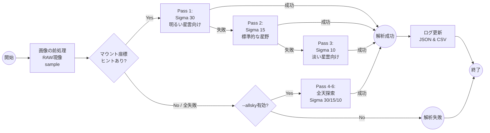
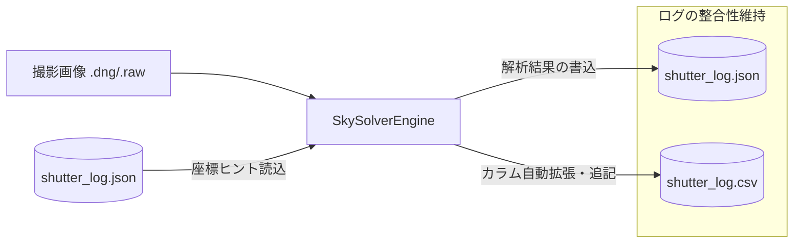

# 🛰️ SkySolverEngine (SSE) v2.0.2 詳細仕様書

## 1. 開発コンセプト
SSE (SkySolverEngine) は、PENTAX K-1 Mark II などの高画素フルサイズ機による天体撮影において、「対象を選ばない安定したプレートゾルブ」を実現するための解析エンジンです。特に、明るい星雲（M42等）のガスによる誤認や、淡い対象（バラ星雲等）での検出不足を、多段階のシグマ値制御によって解決します。

---

## 2. 解析アルゴリズム：多段階「網の目」戦略
単一のコマンド実行ではなく、成功するまでパラメータを自動変動させて試行を繰り返す6段構えの「フォールバック・ロジック」を採用しています。

### 2.1 ヒントあり解析 (Hint-Search)
マウントから供給される RA/Dec 座標の半径 $10.0^\circ$ 以内を探索します。

| パス | ターゲット例 | Sigma ($\sigma$) | 目的 |
| :--- | :--- | :--- | :--- |
| **Pass 1** | M42, M45, 二重星団 | **30** | 明るい星雲（ガス）を無視し、主要な星のみで高速合致させる。 |
| **Pass 2** | 一般的な星野 | **15** | 標準的な感度。バランス良く星を抽出。 |
| **Pass 3** | バラ星雲, 薄雲下 | **10** | 感度を最大化し、淡い星を拾い集めて救済する。 |

### 2.2 全天ブラインド解析 (All-Sky Search)
`--allsky` 有効時、またはヒント失敗時に実行されます。

* **探索順序**: Pass 4 ($\sigma=30$) → Pass 5 ($\sigma=15$) → Pass 6 ($\sigma=10$)
* **タイムアウト**: 各パス **45秒**（全天インデックスのロード時間を考慮）。
* **Downsample**: 固定で **4** を適用し、高画素データのノイズを抑制。

### 2.3 6段構え解析ロジックのフロー図


---

## 3. 画像処理パイプライン (K-1 Mark II 最適化)
3600万画素の RAW データを直接エンジンに渡すと、微細ノイズを星と誤認し解析が停滞するため、以下の前処理を行います。

1. **RAWデモザイク**: `rawpy` を使用し、カメラのWBを維持したまま `half_size=True` で読み込み。
2. **ダウンサンプリング ($ds=4$)**: 解像度を適切に縮小し、星の信号対雑音比（SNR）を向上させます。
3. **中間フォーマット**: `solve-field` への入力用に、一時的な高画質 JPEG を `workdir` 内に生成。

---
## 4. コマンドの入力方法 (CLI Usage)

SSE は、端末（ターミナル）からコマンドを入力して操作します。解析の目的に合わせて「モード」「対象」「オプション」を組み合わせて実行します。

### 4.1 基本コマンド形式
```bash
python3 SSE.py [モード] [解析対象のパス] [追加オプション]
```

### 4.1 基本コマンド
特定のディレクトリ内にある未解析の画像を、ヒント座標を用いて一括処理します。
```bash
python3 SSE.py select ~/Pictures/M42_Project/
```
### 4.2 引数とオプションの詳細解説

SSEを実行する際、動作を制御するための主要な引数とオプションは以下の通りです。

| 項目 | 指定値の例 | 内容説明 |
| :--- | :--- | :--- |
| **モード** | `select` | 指定したフォルダやファイルを解析対象とする標準的な実行モードです。 |
| **解析対象のパス** | `~/Pictures/M42/` | 画像ファイル（.dng等）そのもの、または画像が格納されているフォルダをフルパスで指定します。 |
| **オプション1** | `--allsky` | **【全天探索】** マウントからの座標ヒントで解決できない場合、自動で全天領域から場所を特定するブラインドサーチ（Pass 4〜6）を実行します。 |
| **オプション2** | `--force` | **【強制再解析】** ログ上で「解析成功」と記録されている画像であっても、スキップせずに最初から解析をやり直します。 |


#### オプションの使い分けガイド
* **通常時**: 引数なしで実行。撮影ログの座標を頼りに高速（数秒）で処理を完了させます。
* **同期ズレ・構図不明時**: `--allsky` を付与。ヒント検索に失敗しても、最大45秒のタイムアウト設定で粘り強く空を探します。
* **設定変更後の再テスト**: `--force` を付与。シグマ値の調整（30→15→10）が正しく機能するか、過去の失敗画像で試す際に使用します。

### 4.3 代表的な実行パターン

撮影の状況や解析の目的に応じて、以下のコマンドを使い分けます。

#### ① 通常の解析（標準的な運用）
撮影ログ（`shutter_log.json`）に記録されたマウントの座標をヒントにして、未解析の画像のみを高速で処理します。通常の撮影後のデータ整理に最適です。
```bash
python3 SSE.py select ~/Pictures/2026-02-11_Orion/
```

#### ② 構図が不明な画像の解析（ブラインド・サーチ）
マウントの同期がズレている場合や、手動で導入して座標情報がログにない場合に使用します。ヒント検索に失敗した後、自動的に全天探索（Pass 4〜6）へ切り替わり、最大45秒かけて全天から位置を特定します。

```bash
python3 SSE.py select ~/Pictures/Unknown_Target/ --allsky
```
#### ③ アルゴリズム更新後の全件再チェック（強制実行）
本バージョンの「6段構えロジック」の効果を、過去に解析済み（または失敗済み）の画像ですべて試したい場合に使用します。既存の success ステータスを無視して、最新設定でログを書き換えます。
```bash
python3 SSE.py select ~/Pictures/M42_Project/ --force
```
#### ④ 複雑な条件での実行（全天 ＋ 強制）
「以前失敗した未知の構図」に対して、最新の低シグマ設定（Pass 6）まで動員して再解析をかけたい場合に有効です。

```bash
python3 SSE.py select ~/Pictures/Failed_Last_Time/ --allsky --force
```

## 5. 設定ファイルの説明 (config.json)

SSE の動作環境は `config.json` で管理可能です（内部デフォルト値の外部定義用）。

| 項目 | 型 | 説明 |
| :--- | :--- | :--- |
| **workdir** | string | 解析用の中間ファイル（JPEG等）を生成する一時ディレクトリ。 |
| **all_sky_enabled** | boolean | デフォルトでブラインドサーチを許可するかどうか。 |
| **force_mode** | boolean | 解析済みでも再処理するかどうか。 |
| **cpulimit** | int | 1つのプロセスに割り当てる最大実行時間（秒）。 |
## 6. データ・インテグレーション仕様

### 6.1 JSON 構造 (shutter_log.json)
`analysis` セクションを完全置換することで、旧バージョンの不要データを排除します。
* **Confidence**: $log(odds\ ratio)$ を記録。
* **Process Stats**: 解析にかかった秒数と、照合された星の数を記録。

### 6.2 CSV 堅牢性仕様 (shutter_log.csv)
* **メモリ・ロード型更新**: ファイル全体を一度ロードし、該当行のみを書き換えて一括保存することで、書き込み中のファイル破損を防ぎます。
* **動的カラム拡張**: `Solve_RA`, `Solve_DEC`, `Solve_Orientation`, `Solve_Path` 等の列がない場合、実行時に自動追加します。

### 6.3 データ更新の仕組み（インテグレーション図）

---

## 7. インジケーターの定義

### 7.1 Stars Rating (星の評価)
照合された星の数（`matched_stars`）に基づき算出します。
* ★5: 50個以上
* ★4: 30個以上
* ★3: 15個以上
* ★2: 10個以上
* ★1: それ未満

### 7.2 Mount Drift (マウントのズレ)
マウント報告座標 $(RA_h, Dec_h)$ と解析結果 $(RA_s, Dec_s)$ の球面距離を算出します。
$$Dist = \sqrt{(\Delta RA \cdot \cos(Dec_h))^2 + (\Delta Dec)^2} \cdot 60 \text{ (arcmin)}$$
* **Excellent**: $5'$ 未満
* **Need Sync**: $5'$ 以上

---

## 8. 運用上の制限
* **CPU Limit**: 各解析プロセスは `cpulimit 30` (秒) で強制遮断されます。
* **Scale Units**: `--scale-units degwidth` を採用。画像の横幅（度）を基準にインデックスを絞り込みます。