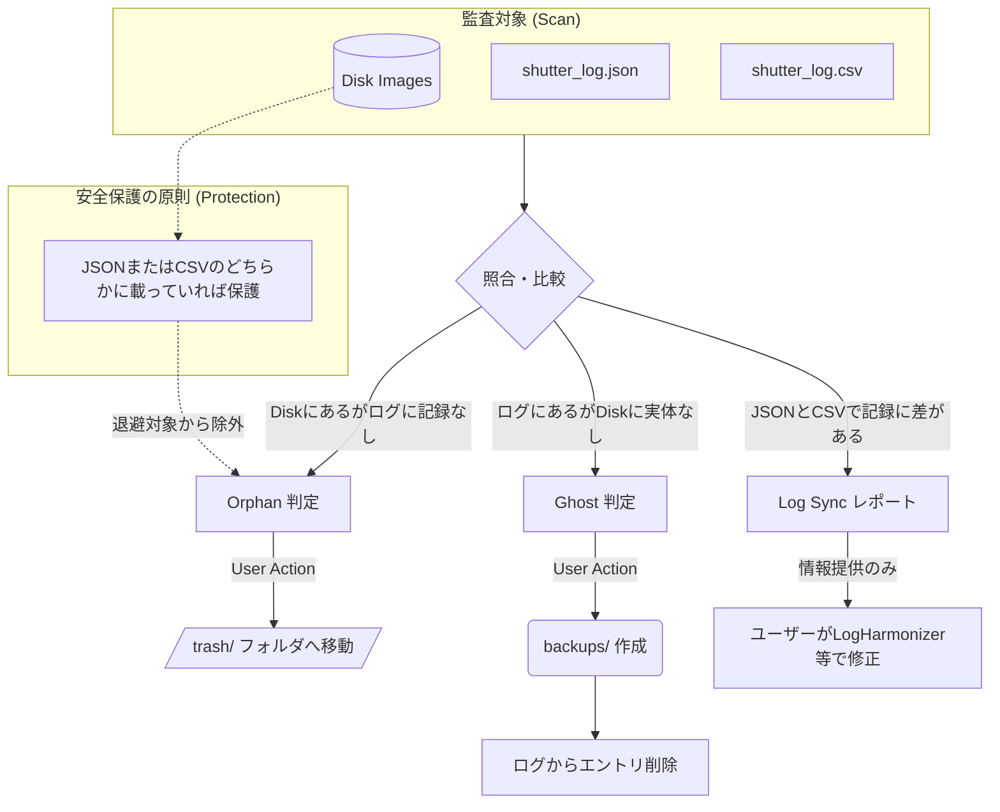

# ImageFileHarmonizer (v1.6.0)

ログファイル (`shutter_log.json`, `shutter_log.csv`) とディスク上の画像ファイルの実体を突き合わせ、整合性を監査・整理するためのツールです。


## コンセプト
本ツールの主要な役割は、**「ログに記録のない不要なファイルをディスクから整理すること」**です。
あくまでログの状態を「正」とし、実体ファイルをログに合わせるための管理機能を提供します。

## 主な機能と仕様
*   **3方向監査 (Audit)**: ディスク上の実ファイル、JSONログ、CSVログの3つをクロスチェックします。
*   **ファイル整理（基本機能）**: 
    *   **Orphans（孤立ファイル）**: 実体はあるが、ログ（JSON/CSV）のいずれにも記録がないファイル。
    *   **判定ロジック**: ファイル保護を優先し、**JSONまたはCSVのどちらか一方にでも名前があれば保護（退避しない）**されます。
    *   **処理**: 整理を実行すると、該当ファイルは `trash/` フォルダへ移動されます。
*   **ログのクリーンアップ（補助機能）**:
    *   **Ghosts（幽霊ログ）**: ログに記録はあるが、実体ファイルが存在しないエントリ。
    *   **処理**: ユーザーの選択により、ログから「存在しないファイルのエントリ」を削除できます。
    *   **注意**: 逆に、**「ディスクにファイルがあるからといって、ログに自動でエントリを書き足す」機能はありません。** 正しい記録は撮影時または専用ツールでログに作成されている必要があります。

## JSONとCSVに差異がある場合の挙動
本ツールは、ログ同士の内容（値）の不一致を自動で修正することはありません。
*   **保護の挙動**: 「JSONにしかないファイル」や「CSVにしか載っていないファイル」は、不整合として `Log Sync` セクションで報告されますが、**ファイルは削除（退避）対象になりません。**
*   **解決方法**: ログ同士の内容を同期させたい場合は、`logharmonizer1_6.py` を使用して解決してください。

## 使い方

### 監査レポートの表示のみ（Dry-run）
```bash
python3 imgfileharmonizer1_6.py /path/to/images/ --no-interactive
```

### 整理の実行（対話モード）
```bash
python3 imgfileharmonizer1_6.py /path/to/images/
```

## 安全のための設計
*   **ゴミ箱 (Trash) 方式**: ファイルは直接削除されず、対象ディレクトリ直下の `trash/` フォルダへ移動されます。
*   **自動バックアップ**: ログを更新（クリーンアップ）する際は、必ず `backups/` フォルダへ元のファイルを保存します。

## 監査ロジックの図解

