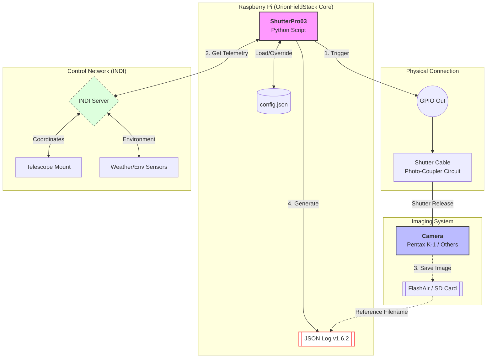

# ShutterPro03 v15.0.5

**Precision Shutter Control & Telemetry Integrator for Astrophotography**

ShutterPro03は、Raspberry Piを用いた天体撮影における物理シャッター制御（リレー/フォトカプラ回路）と、撮影時の環境・機材情報（INDI連携）の自動ロギング、およびFlashAirを介した画像データの自動ダウンロードを統合するオープンソースの制御プログラムです。OrionFieldStack プロジェクトの中核として設計されており、自動解析エンジンに最適化された標準化撮影ログを出力します。

---

## 🛰 概要と特徴

本ツールは、USB経由の制御やデータ転送に対応していない旧式やエントリークラスのカメラでも、高度な自動撮影とワイヤレスワークフローを実現します。
単なるシャッター操作に留まらず、撮影の瞬間にINDIサーバーから天体座標（RA/Dec）や気象データを取得し、画像のEXIFメタデータと同期。**OrionFieldStack JSON Log Specification (v1.6.2)** に基づいた高精度な標準化ログを生成します。

* **柔軟なシャッター制御**: GPIOを介したバルブ撮影およびカメラトリガー制御に対応。
* **物理的な絶縁と安全性**: フォトカプラ（PC817等）を介したシャッター回路により、カメラとRaspberry Piを電気的に分離し保護。
* **環境・マウントデータの統合**: 撮影の瞬間にINDIサーバーから座標（RA/Dec）や気象情報、CPU温度等のテレメトリを自動取得。
* **標準化されたログ出力**: 撮影日時や露出時間、EXIF情報、INDIデータを統合した `shutter_log.json` / `shutter_log.csv` を自動生成。
* **ワイヤレス自動転送**: FlashAir SDカードから新しく撮影された画像を検知し、安定性を確認した上でローカルに自動ダウンロード。

---

## 🛠️ インストールとセットアップ

### 1. ディレクトリの移動
```bash
cd OrionFieldStack/shutterpro03
```

### 2. 専用仮想環境(venv)の作成
システムのライブラリ（RPi.GPIOなど）を参照できるようにしつつ、独立した実行環境を作成します。
```bash
# 仮想環境の作成（システムパッケージを引用）
python3 -m venv --system-site-packages venv

# 仮想環境の有効化
source venv/bin/activate
```

### 3. 依存ライブラリのインストール
```bash
pip install -r requirements.txt
```

---

## 📊 ハードウェア接続（配線図）

カメラのシャッター制御は、Raspberry PiのGPIOピンからフォトカプラ（PC817）を駆動させて行います。

```text
[ Raspberry Pi ]          [ PC817 Photocoupler ]         [ Camera ]
                         +---------------+
  GPIO 27 >---[ 220Ω ]---| 1 (Anode)   4 |--------------> Shutter (Tip)
                         |    (LED) (Tr) | 
  GND     >--------------| 2 (Cath)    3 |--------------> Common (Sleeve)
                         +---------------+
                                  ^
                            (フォトカプラ絶縁)
```

### ⚡ 制限抵抗（220Ω）の計算
フォトカプラ内蔵LEDの順方向電圧を $V_f = 1.2V$、Raspberry Pi 5 のGPIO出力を $V_{cc} = 3.3V$、駆動電流を $I = 10mA$ とすると、必要な制限抵抗 $R$ は以下のようになります。
$$
R = \frac{V_{cc} - V_f}{I} = \frac{3.3 - 1.2}{0.01} = 210 \Omega
$$
そのため、入手が容易な **220Ω** の抵抗を使用します。
*(注: デフォルトのシャッターピンは GPIO 27 (BCM) です。`config.json` で変更可能です)*

---

## 📂 フォルダ構成

```text
~ (Home Directory)
├── OrionFieldStack/        # 【プログラム層】
│   ├── README.md           # プロジェクト全体の概要
│   │
│   └── shutterpro03/       # ShutterPro03 パッケージ
│       ├── README.md       # 本ドキュメント（マニュアル統合版）
│       ├── requirements.txt# 必要な依存ライブラリのリスト
│       ├── config.json     # 全体設定（デフォルト値、接続設定）
│       ├── shutterpro03.py # メイン制御（エントリーポイント、撮影ループ）
│       ├── sp03_utils.py   # 共通ユーティリティ（時間計算、パス変換等）
│       ├── sp03_logger.py  # ログ生成・非同期保存・EXIF解析モジュール
│       └── OFS_json_spec.md# ログファイルの仕様書
│
└── Pictures/               # 【データ層】
    ├── IMG_XXXX.dng        # 撮影・転送された生画像（DNG/RAW/JPG）
    ├── latest_shot.json    # ツール間連携用リアルタイムバッファ
    ├── shutter_log.json    # 累積詳細ログ (JSON)
    └── shutter_log.csv     # 閲覧用累積ログ (CSV)
```

---

## ⚙️ 使用方法と引数・設定項目

ShutterPro03は、`config.json`によるデフォルト動作と、コマンド引数による「一時的な設定上書き（オーバーライド）」の二段階で設計されています。

### コマンド形式
```bash
python3 shutterpro03.py [shots] [mode] [exposure_sec] [options...]
```
* **shots**: 撮影枚数（必須。0を指定すると無限撮影）。
* **mode**: シャッターモード (`bulb` または `camera`)。
* **exposure_sec**: 1枚あたりの露出時間（秒。bulbモードの場合のみ有効）。
* **options**: `key=value` 形式で、`config.json` の設定項目を一時的に上書きします。

### 設定値とエイリアス一覧

実行時に引数として指定できる上書きオプションです。短縮エイリアスに対応しています。

| カテゴリ | 項目 (Config Key) | 引数 (Short/Long) | 役割の詳細 |
| :--- | :--- | :--- | :--- |
| **Context** | **objective** | `obj=` / `objective=` | **[ターゲット特定]** 解析エンジンが天体座標と照合する際の主キーとなります。 |
| | **session** | `sess=` / `session=` | **[データ分類]** 観測夜ごとの管理用。後工程での一括抽出に使用。 |
| | **type** | `t=` / `type=` | **[パイプライン制御]** Light, Dark, Flat等の指定。スタック自動処理フラグ。 |
| **Equipment**| **telescope** | `tel=` / `telescope=` | **[光学特性記録]** 鏡筒ごとの写りの癖や周辺減光の分析に使用。 |
| | **camera** | `cam=` / `camera=` | **[センサー特性記録]** 使用カメラを特定し、ダーク適用ミスを防ぎます。 |
| | **focal_length**| `f=` / `focal=` | **[解析精度]** プレートソルブ時の画角計算に使用。正確なほど高速化。 |
| | **optics** | `opt=` / `optics=` | **[画角変化記録]** レデューサー等の使用をトレース。 |
| | **filter** | `fil=` / `filter=` | **[波長特性記録]** 使用フィルターを記録し、カラーバランス調整の参考に。 |
| **System** | **log_dest** | `log_dest=` | **[保存先制御]** `s2cur` (実行場所) か `s2save` (画像保存先) か。 |
| | **dir** | `dir=` | **[画像保存先]** FlashAir等から画像を取得しローカルに保存するディレクトリ。 |
| **INDI** | **INDI_MOUNT** | `mnt=` / `mount=` | **[マウント特定]** RA/Dec座標を取得する赤道儀のデバイス名（INDI）。 |
| | **INDI_WEATHER** | `wth=` / `weather=` | **[気象センサー特定]** 気温・気圧等を取得するデバイス名（INDI）。 |

### 実行例

#### 1. 60秒のバルブ撮影を10枚実行 (対象: M42, 鏡筒: R200SS)
```bash
python3 shutterpro03.py 10 bulb 60 obj=M42 tel=R200SS
```

#### 2. デフォルト設定で撮影 (Easy Start)
`config.json` に機材名などが設定されていれば、枚数とモード指定のみで開始できます。
```bash
python3 shutterpro03.py 20 bulb 60
```

#### 3. 現場でのテスト撮影 (Test Shot)
露出時間10秒で1枚だけテスト撮影し、フレームタイプを `test` に設定します。
```bash
python3 shutterpro03.py 1 bulb 10 obj=M42 t=test
```

#### 4. ヘルプと設定確認
```bash
python3 shutterpro03.py -h
```
現在の `config.json` から読み込まれたデフォルト設定値が一覧表示されるため、設定確認ツールとしても使用できます。

---

## 📊 システム構造図



---

## 📝 更新履歴

### v15.0.5 (2026-06-20)
* **DNG画像サイズ（Width/Height）検出の修正 (sp03_logger.py)**:
  DNG(RAW)画像において、サムネイル用の解像度（160x120）が優先的に取得されてしまう問題を修正しました。画像の `Image SubIFDs` に格納されている実際の最大寸法（Tag 256/257）をバイナリパースして正確にロギングする機能を追加しました。
* **マニュアルの統合**:
  `sp03_manual.md` に記載されていた詳細な引数のエイリアスや、物理配線図、システム設計情報等の記述を本 `README.md` に統合しました。

### v15.0.4 (2026-06-20)
* **シャッター終了処理とスレッド安全性の向上**:
  セッション終了時、あるいは強制終了（Ctrl+C）時に、バックグラウンドのFlashAirダウンロードスレッドおよびEXIF解析ロガースレッドの処理完了を適切に待機してからプロセスを安全にシャットダウンするシグナルクリーンアップ処理を強化。

---

## ⚖️ License
© 2026 OrionFieldStack Project / MIT License