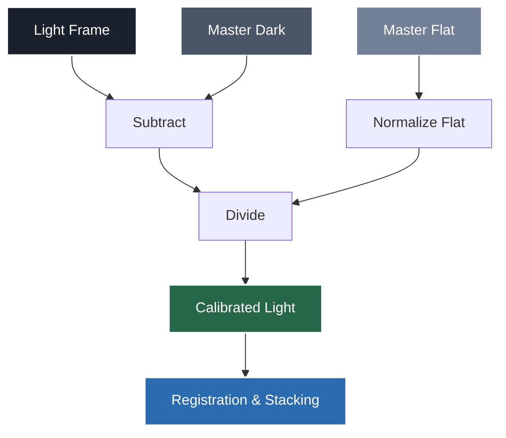

# StarForge v1.4.0

**High-Precision Multi-Session Astronomical Image Stacker & Register**

StarForgeは、`StarFlux` による画像品質解析結果（楕円率など）を活用し、複数の天体画像を自動的に位置合わせ・スタッキングするハイパワーなツールです。

最新バージョン（v1.4.0）では、これまでの**マスターフラットの自動生成・再利用**に加え、新たに**ダークフレーム減算（Dark Subtraction）**をサポートしました。`config.json` による高度な設定管理、フラット/ダーク補正の明示的な **ON/OFF 切り替え**（コマンドライン引数による動的設定表示）、および **詳細なセッションレポート（Markdown & HTML）の自動出力** を提供します。

また、出力ディレクトリ（`--out_dir`）を柔軟に指定し、出力ファイルを整理できるようになりました。

---

## 🛰 Installation & Setup

StarForgeは以下のライブラリを使用します。
- `astroalign`: 画像の幾何学的変換（位置合わせ）
- `rawpy`: RAW/DNGファイルの現像
- `astropy`, `numpy`: データの操作とFITS出力
- `scipy`, `scikit-image`: 画像処理およびスタック演算アルゴリズム

### セットアップ手順
```bash
cd OrionFieldStack/starforge
python3 -m venv --system-site-packages venv
source venv/bin/activate
pip install -r requirements.txt
```

---

## ⚙️ Configuration (`config.json`)

`starforge.py` と同じディレクトリに `config.json` を配置することで、共通設定を保持できます。

```json
{
    "threshold": 0.2,
    "method": "sigma_clip",
    "mode": "mono",
    "out": "AUTO",
    "out_dir": "./output",
    "use_flat": false,
    "flat_dir": "~/Pictures/flat",
    "use_dark": false,
    "dark_dir": "~/Pictures/dark"
}
```
※コマンドライン引数は、この設定ファイルの内容を常に上書き（オーバーライド）します。

---

## 🚀 Usage

### 基本操作
```bash
# 仮想環境を有効化して実行
./venv/bin/python3 starforge.py [入力パス...] [オプション]
```

### ヘルプ表示の活用
`--help` を実行すると、キャリブレーションオプション（フラット、ダーク）が機能ごとにブロック化され、**現在適用されている値**（`config.json`のデフォルト設定）が黄緑色の `[Enabled]` / `[Disabled]` で表示されます。これにより、その実行でキャリブレーションが行われるかどうかが一目で分かります。

---

## 🛠 Options

| オプション | デフォルト | 内容説明 |
| :--- | :--- | :--- |
| `inputs` | (必須) | 画像ファイル、ディレクトリ、またはワイルドカード。 |
| `--mode` | `mono` | 処理モード (`color` または `mono`) を選択。 |
| `--threshold` | `0.2` | スタック対象とする楕円率の最大しきい値。 |
| `--session` | - | 指定した Session ID(s) の画像のみを抽出。 |
| `--obj` | - | 指定した Objective 名(s) の画像のみを抽出。 |
| `--flat` / `--no-flat` | `OFF` | フラット補正の有効/無効を指定。 |
| `--dark` / `--no-dark` | `OFF` | ダーク減算の有効/無効を指定。 |
| `--flat_dir` | - | フラット画像群が含まれるディレクトリ。 |
| `--dark_dir` | - | ダーク画像群が含まれるディレクトリ。 |
| `--method` | `sigma_clip` | スタッキング手法 (`median`, `mean`, `sigma_clip`)。 |
| `--out` | `AUTO` | 出力ファイル名。`AUTO` でセッション情報から動的生成。 |
| `--out_dir` | `.` | FITSファイルおよびレポートの出力先ディレクトリ。 |

### 📁 動的な出力ファイル名 (`AUTO`)
`--out` が `AUTO` の場合、以下のパターンでファイル名を自動生成します。
`[Session]_[Object]_[Mode]_[YYMMDDHHmm].fits`
例: `20260321_2345_NGC4565_color_2604272102.fits`

---

## 🧮 キャリブレーションの処理フローと式

フラット補正およびダーク減算が有効な場合、各ライトフレームに対して以下の計算式と順序でキャリブレーションが適用されます。対応する**マスターフレーム**は、画像メタデータの `session_id` に基づいて自動的に照合・生成され、ディスクにキャッシュ（再利用）されます。

**計算式**:
`Calibrated = (Light - MasterDark) / NormalizedMasterFlat`
*(※ 計算結果がマイナスになる場合は `0` にクリップされます)*



### 処理フローの詳細
1.  **メタデータ同期**: `shutter_log.json` (v1.6.2準拠) から品質・セッション・露光時間・温度・ISO等の情報を取得します。
2.  **不一致チェック**: ライトとキャリブレーションフレーム（ダーク等）の間で**露光時間**(0.1s以上差)、**温度**(2.0℃以上差)、または**ISO設定**が異なる場合、コンソールとレポートに警告（Warning）を出力します。
3.  **マスターフレーム生成**:
    - `dark_dir` / `flat_dir` 内に `master_dark_[Session]_[Mode].fits` などがあれば自動ロードします。
    - 存在しない場合、ディレクトリ内の対象フレームを `median` スタックしてマスターを新規生成し、自動保存します。
4.  **レジストレーション**: `astroalign` によるサブピクセル精度の星位置合わせ。
5.  **スタッキング**: メモリ効率を考慮した合成処理。
6.  **レポート生成**: 撮像・スタック結果および使用したダーク/フラットフレーム群のリストを集約し、MD/HTMLレポートを出力。

---

## 📊 Session Reports

スタッキング完了後、以下の3種類のレポートファイルが自動生成されます。これらは `--out_dir` で指定したフォルダに、FITSファイルと同じベース名で保存されます。

1.  **`{basename}.md`**:
    - 日本語/英語のバイリンガル形式。
    - 撮影機材、スタック統計、Plate Solve結果（RA/DEC/回転角）、キャリブレーション状態、各種フレームリストを網羅。
2.  **`{basename}_summary.html`**:
    - 要約版HTMLレポート（Voyagerスタイル）。
    - 撮影の概要とキャリブレーションの有効/無効を素早く確認可能。
3.  **`{basename}_full.html`**:
    - 詳細版HTMLレポート。
    - サマリの内容に加え、使用された全ライト・ダーク・フラットフレームのリストや警告（Warning）事項が含まれます。

---

## ⚖️ License
© 2026 OrionFieldStack Project / MIT License
